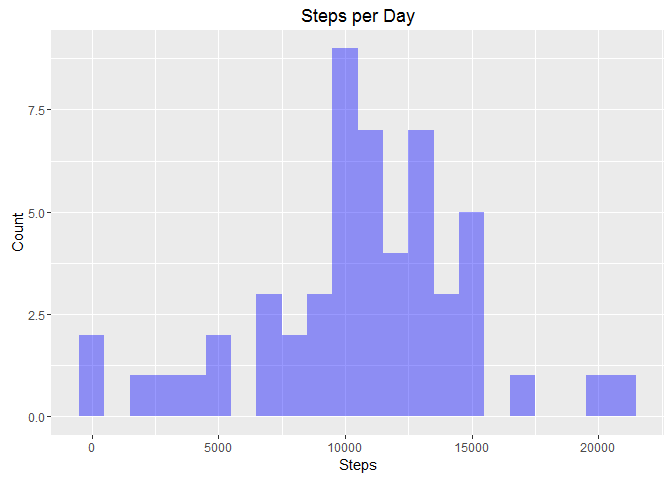
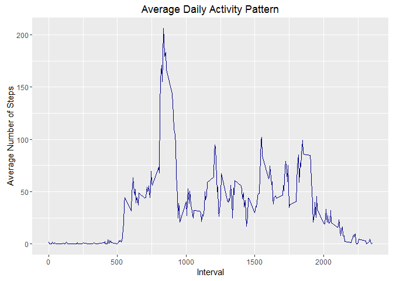
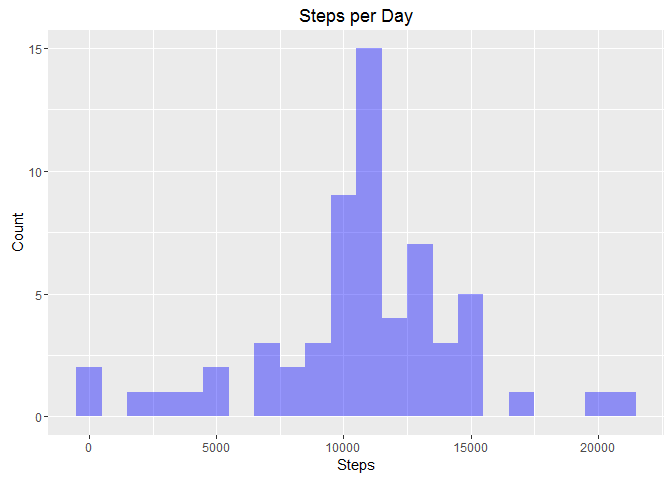
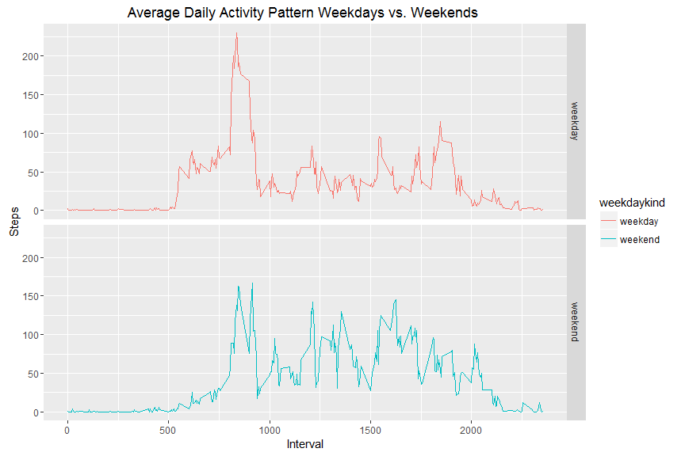

# Reproducible Research: Peer Assessment 1
Jesse Beaumont  
June 12, 2016  


### Loading and preprocessing the data

 The variables included in this dataset are:
  
- steps: Number of steps taking in a 5-minute interval (missing values are coded as NA)
- date: The date on which the measurement was taken in YYYY-MM-DD format
- interval: Identifier for the 5-minute interval in which measurement was taken


```r
activity <- read.csv("./activity/activity.csv")
```


### What is mean total number of steps taken per day?

```r
steps_by_day <- aggregate(list(steps=activity$steps),
                          list(day = activity$date),
                          sum)
```

Make a histogram of the total number of steps taken each day


```r
ggplot(na.omit(steps_by_day), aes(x=steps)) +
   geom_histogram(alpha = 0.4, fill = "blue", binwidth= 1000) + 
   ggtitle(label = "Steps per Day") + 
   labs(x = "Steps", y = "Count")
```

<!-- -->

Calculate and report the mean and median total number of steps taken per day


```r
summary(steps_by_day)
```

```
##          day         steps      
##  2012-10-01: 1   Min.   :   41  
##  2012-10-02: 1   1st Qu.: 8841  
##  2012-10-03: 1   Median :10765  
##  2012-10-04: 1   Mean   :10766  
##  2012-10-05: 1   3rd Qu.:13294  
##  2012-10-06: 1   Max.   :21194  
##  (Other)   :55   NA's   :8
```

```r
mean(steps_by_day$steps)
```

```
## [1] NA
```

```r
median(steps_by_day$steps)
```

```
## [1] NA
```


### What is the average daily activity pattern?

Make a time series plot (i.e. type = "l") of the 5-minute interval (x-axis) and the average number of steps taken, averaged across all days (y-axis)


```r
mean_daily_activity_pattern <- aggregate(list(mean_steps=na.omit(activity)$steps),
                                         list(interval = na.omit(activity)$interval),
                                         mean)
head(mean_daily_activity_pattern)
```

```
##   interval mean_steps
## 1        0  1.7169811
## 2        5  0.3396226
## 3       10  0.1320755
## 4       15  0.1509434
## 5       20  0.0754717
## 6       25  2.0943396
```

```r
ggplot(mean_daily_activity_pattern, aes(x = interval, y=mean_steps)) + 
   geom_line(color="darkblue") +
   ggtitle(label = "Average Daily Activity Pattern") + 
   labs(x = "Interval", y = "Average Number of Steps")
```

<!-- -->

Which 5-minute interval, on average across all the days in the dataset, contains the maximum number of steps?

```r
mean_daily_activity_pattern[which.max(mean_daily_activity_pattern$mean_steps),]
```

```
##     interval mean_steps
## 104      835   206.1698
```

### Imputing missing values

Calculate and report the total number of missing values in the dataset (i.e. the total number of rows with NAs)


```r
count_of_missing_values <- sum(is.na(activity$steps))
count_of_missing_values
```

```
## [1] 2304
```

Imput missing values by calculating the mean number of steps per interval and apply back using an index on missing values.


```r
missing_obs_vector <- is.na(activity$steps)
mean_steps_by_interval <- tapply(activity$steps, activity$interval, 
                                 mean, 
                                 na.rm=TRUE,
                                 simplify=TRUE)
```

*(Create a new dataset that is equal to the original dataset but with the missing data filled in)*


```r
activity2 <- activity
```


```r
activity2$steps[missing_obs_vector] <- mean_steps_by_interval[as.character(activity$interval[missing_obs_vector])]
count_of_missing_values <- sum(is.na(activity2$steps))
count_of_missing_values
```

```
## [1] 0
```


Make a histogram of the total number of steps taken each day and Calculate and report the mean and median total number of steps taken per day.


```r
steps_by_day <- aggregate(list(steps=activity2$steps),
                          list(day = activity2$date),
                          sum)
ggplot(na.omit(steps_by_day), aes(x=steps)) +
   geom_histogram(alpha = 0.4, fill = "blue", binwidth= 1000) + 
   ggtitle(label = "Steps per Day") + 
   labs(x = "Steps", y = "Count")
```

<!-- -->


```r
mean(steps_by_day$steps)
```

```
## [1] 10766.19
```

```r
median(steps_by_day$steps)
```

```
## [1] 10766.19
```

These values differ slightly from the estimates prior to imputing steps for missing values.  After imputing values, the mean and median are the same value.


### Are there differences in activity patterns between weekdays and weekends?

Create a new factor variable in the dataset with two levels -- "weekday" and "weekend" indicating whether a given date is a weekday or weekend day.


```r
library(lubridate)
```

```
## 
## Attaching package: 'lubridate'
```

```
## The following object is masked from 'package:base':
## 
##     date
```

```r
activity2$date <- ymd(activity$date)
activity2$weekdaykind <- ifelse(weekdays(activity2$date) %in% c('Saturday','Sunday'), "weekend", "weekday")
```

Make a panel plot containing a time series plot (i.e. type = "l") of the 5-minute interval (x-axis) and the average number of steps taken, averaged across all weekday days or weekend days (y-axis). The plot should look something like the following, which was created using simulated data:


```r
activity_pattern_summary <- aggregate(list(steps=activity2$steps),
                                      list(interval = activity2$interval, weekdaykind = activity2$weekdaykind),
                                      mean)


ggplot(activity_pattern_summary, aes(x = interval, y = steps, color = weekdaykind)) +
   geom_line() +
   ggtitle(label = "Average Daily Activity Pattern Weekdays vs. Weekends ") +
   labs(x = "Interval", y = "Steps") + 
   facet_grid(weekdaykind ~ .)
```

<!-- -->
